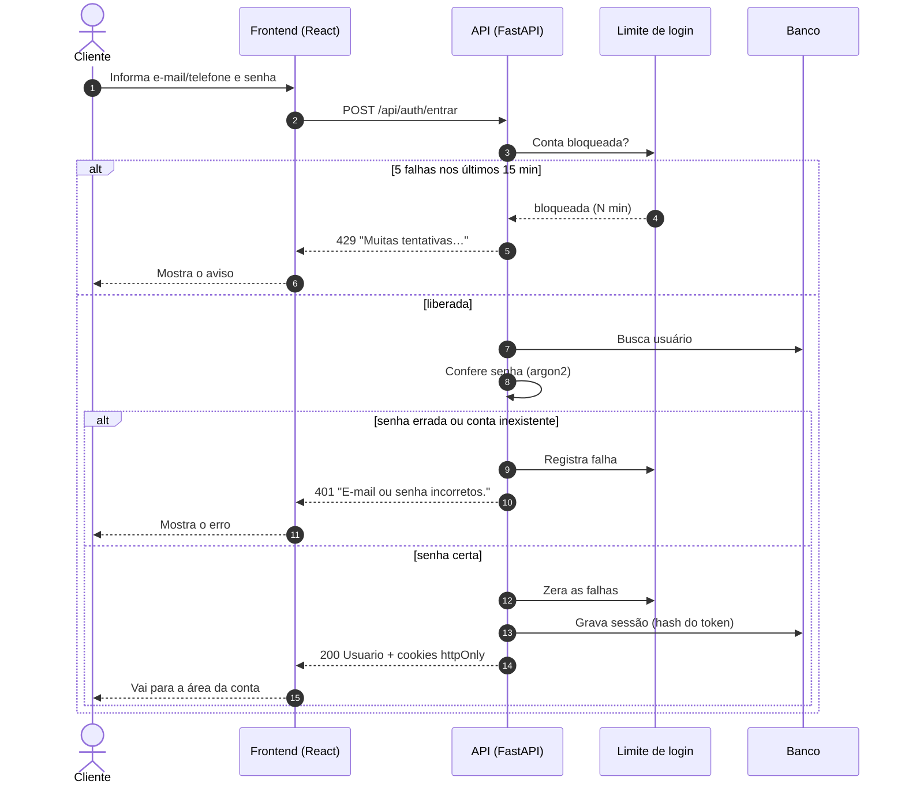
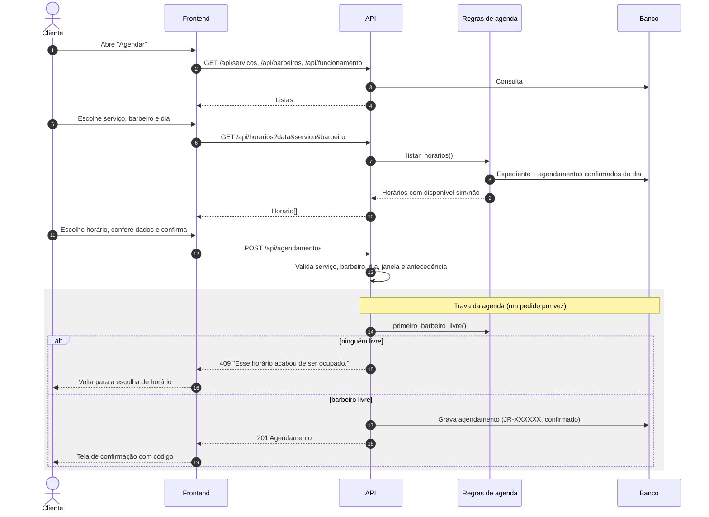
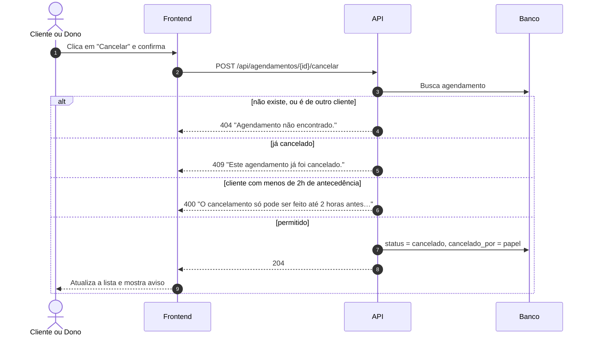

# Diagramas de Sequência

## 1. Entrar (login com senha)

```mermaid
sequenceDiagram
    autonumber
    actor C as Cliente
    participant F as Frontend (React)
    participant A as API (FastAPI)
    participant L as Limite de login
    participant B as Banco

    C->>F: Informa e-mail/telefone e senha
    F->>A: POST /api/auth/entrar
    A->>L: Conta bloqueada?
    alt 5 falhas nos últimos 15 min
        L-->>A: bloqueada (N min)
        A-->>F: 429 "Muitas tentativas…"
        F-->>C: Mostra o aviso
    else liberada
        A->>B: Busca usuário
        A->>A: Confere senha (argon2)
        alt senha errada ou conta inexistente
            A->>L: Registra falha
            A-->>F: 401 "E-mail ou senha incorretos."
            F-->>C: Mostra o erro
        else senha certa
            A->>L: Zera as falhas
            A->>B: Grava sessão (hash do token)
            A-->>F: 200 Usuario + cookies httpOnly
            F-->>C: Vai para a área da conta
        end
    end
```

## 2. Agendar horário

```mermaid
sequenceDiagram
    autonumber
    actor C as Cliente
    participant F as Frontend
    participant A as API
    participant R as Regras de agenda
    participant B as Banco

    C->>F: Abre "Agendar"
    F->>A: GET /api/servicos, /api/barbeiros, /api/funcionamento
    A->>B: Consulta
    A-->>F: Listas
    C->>F: Escolhe serviço, barbeiro e dia
    F->>A: GET /api/horarios?data&servico&barbeiro
    A->>R: listar_horarios()
    R->>B: Expediente + agendamentos confirmados do dia
    R-->>A: Horários com disponível sim/não
    A-->>F: Horario[]
    C->>F: Escolhe horário, confere dados e confirma
    F->>A: POST /api/agendamentos
    A->>A: Valida serviço, barbeiro, dia, janela e antecedência
    rect rgb(240, 240, 240)
        Note over A,B: Trava da agenda (um pedido por vez)
        A->>R: primeiro_barbeiro_livre()
        alt ninguém livre
            A-->>F: 409 "Esse horário acabou de ser ocupado."
            F-->>C: Volta para a escolha de horário
        else barbeiro livre
            A->>B: Grava agendamento (JR-XXXXXX, confirmado)
            A-->>F: 201 Agendamento
            F-->>C: Tela de confirmação com código
        end
    end
```

## 3. Cancelar agendamento

```mermaid
sequenceDiagram
    autonumber
    actor U as Cliente ou Dono
    participant F as Frontend
    participant A as API
    participant B as Banco

    U->>F: Clica em "Cancelar" e confirma
    F->>A: POST /api/agendamentos/{id}/cancelar
    A->>B: Busca agendamento
    alt não existe, ou é de outro cliente
        A-->>F: 404 "Agendamento não encontrado."
    else já cancelado
        A-->>F: 409 "Este agendamento já foi cancelado."
    else cliente com menos de 2h de antecedência
        A-->>F: 400 "O cancelamento só pode ser feito até 2 horas antes…"
    else permitido
        A->>B: status = cancelado, cancelado_por = papel
        A-->>F: 204
        F-->>U: Atualiza a lista e mostra aviso
    end
```
